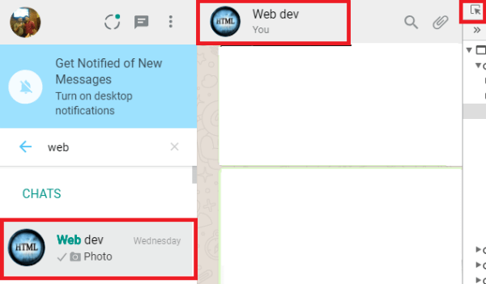
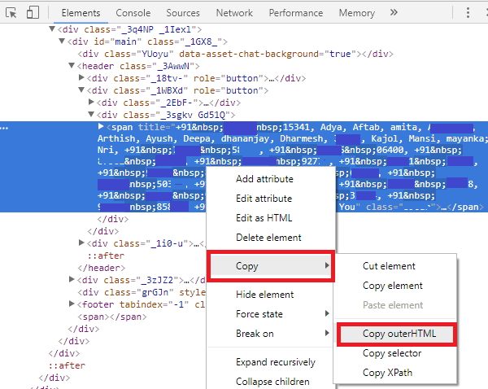
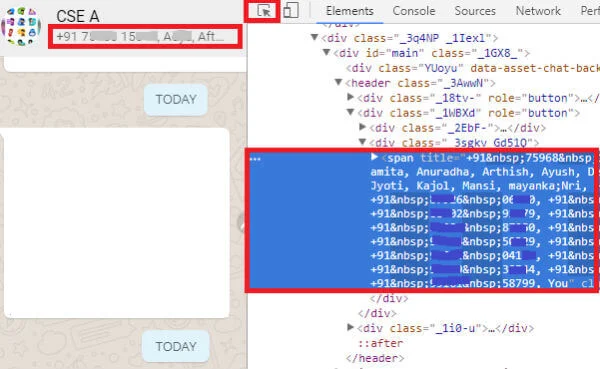
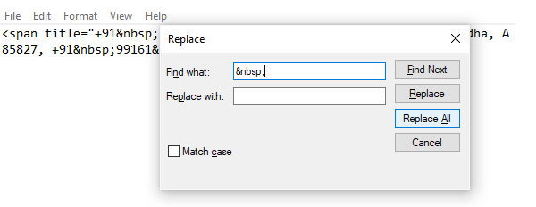

# Como gerar o dataset?

## Buscando histórico

Para gerar o histórico da conversa de um grupo:

1. Abra o grupo no celular ou whatsapp web
1. Clique em "Mais".
1. Clique em "Exportar conversa"
1. Selecione "Sem Mídia"
1. Envie por e-mail para você mesmo

[Documentação oficial do Whatsapp](https://faq.whatsapp.com/android/chats/how-to-save-your-chat-history/?lang=en)

## Buscando lista de usuários

A lista de usuário é necessária para algumas análises como encontrar "usuários zumbis".

Abra o whatsapp web e selecione o grupo que quer extrair os usuários.

Encontre o bloco de código que contém os elementos. Para isso utilize a interface de inspecionar elemento. No firefox abre a aba de desenvolvedor com `CTRL+SHIFT+I` e selecione a ferramenta.

Copie o elemento usando outer HTML

Limpe os dados no editor de sua preferência da find and replace no bloco: `&nbsp;`

